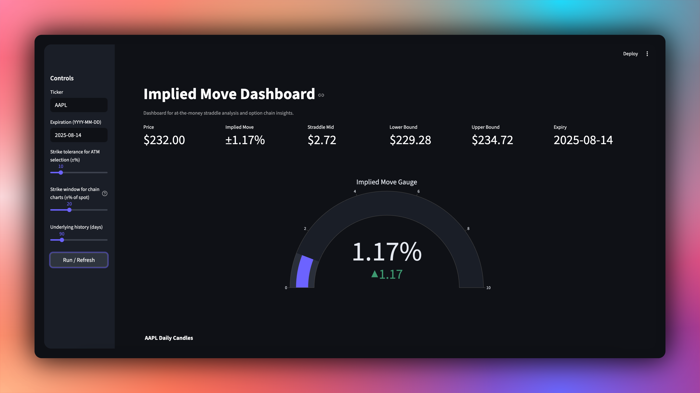

## Implied Move Calculator

Simple program that estimates a stock's implied move for the next expiration by pricing the at‑the‑money straddle using Alpaca options data. It prints a compact, readable summary.

### Demos

- Terminal CLI summary:


- Streamlit UI dashboard:


### Requirements

- Alpaca API keys with options market data access

### Setup
1) Create a `.env` file in the project root (or set these in your shell):
```
ALPACA_API_KEY=your_key_here
ALPACA_API_SECRET=your_secret_here
```

2) Install dependencies and run.

Option A — uv (recommended):
```
uv sync
uv run implied-move
```

Option B — pip/venv:
```
python -m venv .venv
source .venv/bin/activate
pip install .
implied-move
```

You can also run without installing the script entry point:
```
uv run python implied_move.py
# or
python implied_move.py
```

### Usage
- The program will prompt: `Enter the stock symbol (or 'q' to quit):`
- Expiration defaults to today (next available expiry is chosen if needed).
- If the exact ATM strike is missing, it selects the nearest strike within a ±10% window.

### How it finds the straddle
- **ATM strike**: Fetches the latest trade price and truncates to an integer; that price is used as the requested at‑the‑money strike.
- **Expiration selection**:
  - First tries contracts for the requested date (defaults to today).
  - If none are found, it broadens the search to any expiration and then chooses the nearest expiration on or after the requested date. If none exist, it picks the closest expiration overall.
- **Strike search window**: Starts with a ±10% tolerance around the requested strike. If no contracts are found within the window for that expiration, it retries without bounds; if still empty, it searches across any expiration.
- **Nearest strike**: Among the found contracts (optionally filtered to the selected expiration), it picks the contract whose strike is numerically closest to the requested strike.
- **Pricing**: Computes each leg’s mid price as `(bid + ask) / 2`, using `latest_quote` when available, falling back to top‑level `bid_price`/`ask_price` if needed.
- **Straddle**: Prices both the call and the put at the selected strike/expiration and sums the two mid prices.

### Notes
- Requires access to Alpaca options data. Some tickers or market states may not have quotes.
- Script entry point installed by this project is `implied-move` (see `pyproject.toml`).

